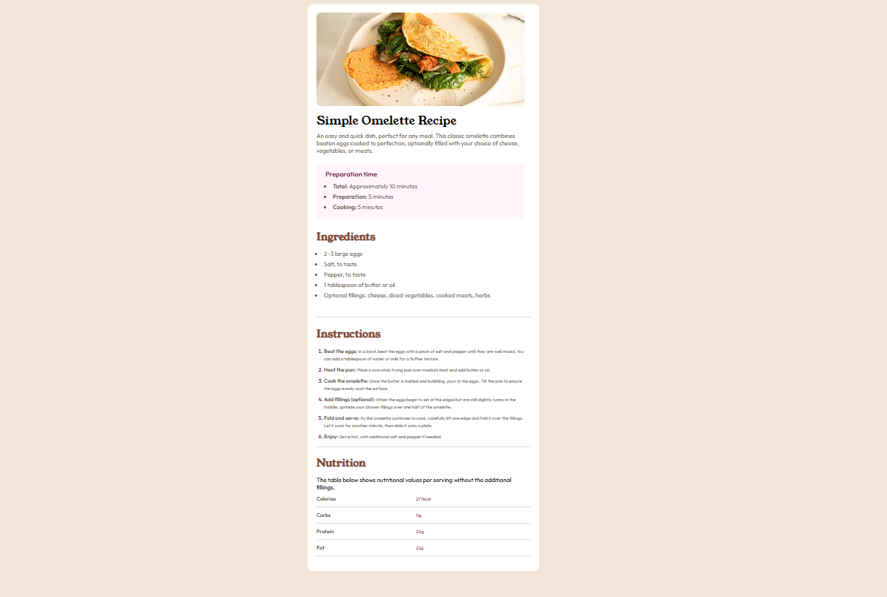

# 🍳 Recipe Design Page

A modern and responsive **Recipe Instruction Page** built using **HTML** and **CSS**. This design features a clean and elegant layout with sections for the recipe image, description, preparation details, ingredients, step-by-step instructions, and a nutrition table.

---

## ✨ Features

- Clean and professional white-themed design
- Responsive layout for desktop, tablet, and mobile
- Hero image section with rounded corners
- Preparation details in a highlighted box
- Ingredients list with bullet points
- Numbered instructions with bold titles and subtext
- Nutrition facts table with styled columns
- Mobile-friendly responsive table structure
- Custom typography using **Google Fonts**
- Color scheme:  
  - Primary Text: `#5F574E`  
  - Section Headings: `#854632`  
  - Highlighted Elements: `#7B284F`

---

## 📂 Project Structure

recipe-page/

├── **index.html** → Main HTML file  
├── **style.css** → CSS styles for the design  
└── **README.md** → Project documentation  

---
## 🎨 Preview

Here’s a screenshot of the final design:

---

## ✅ How to Use

1. Clone this repository or download the files.
2. Open `index.html` in any modern browser.
3. Customize the content, colors, and fonts as per your needs.

---

## 📱 Responsive Design

- Uses **flexbox** and **media queries** for responsiveness.
- Nutrition table adapts for smaller screens without breaking the layout.
- Font sizes adjust dynamically for different viewports.

---

## 🎨 Preview

- **Desktop View**: Full table layout, hero image, and structured content.
- **Mobile View**: Stacked content with optimized spacing.

---

## 🔧 Technologies Used

- **HTML5** for semantic structure
- **CSS3** for styling and responsiveness
- **Google Fonts** for modern typography

---

## 📌 Future Enhancements

- Add interactive elements (e.g., ingredient checkboxes).
- Include a **dark mode toggle**.
- Convert into a **React component** for reuse.

---

### 💻 Ready to Use!
Simply open the `index.html` file in your browser and enjoy the responsive recipe page design.
